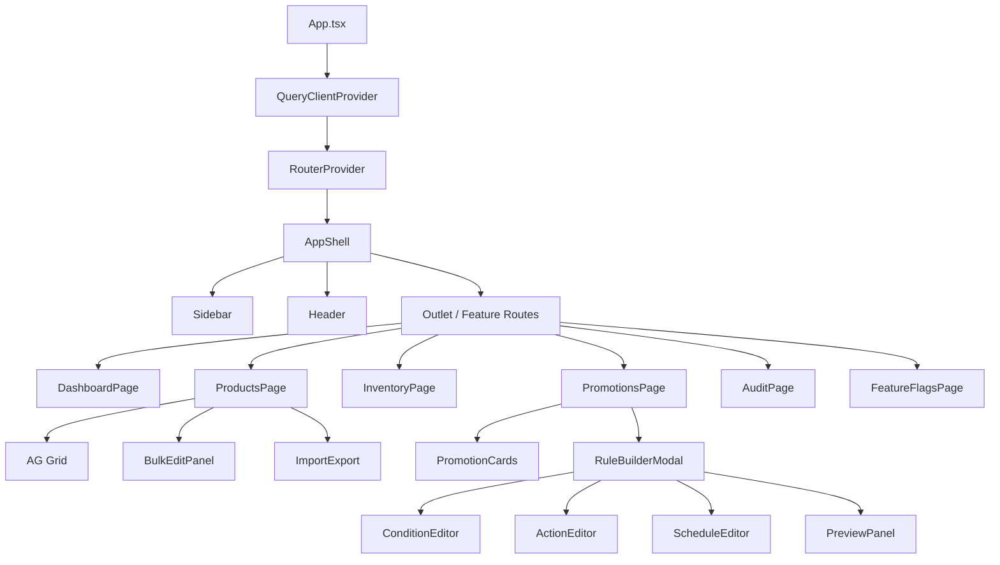
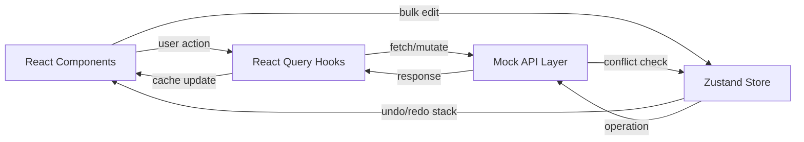
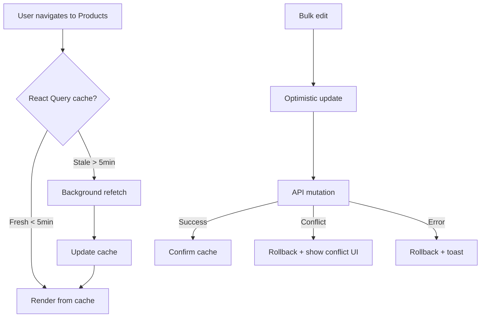

# Architecture — AdminHub E-Commerce Admin Portal

## Component Architecture



## Data Flow



## State Management Strategy

| State Type | Tool | Reasoning |
|-----------|------|-----------|
| **Server state** | React Query | Caching, deduplication, background refresh, stale-while-revalidate |
| **Auth state** | Zustand (`useAuthStore`) | Global singleton, needs access from any component |
| **Bulk operations** | Zustand (`useBulkOperations`) | Undo/redo stack needs Immer integration, global keyboard shortcuts |
| **Feature flags** | Zustand (`useFeatureFlags`) | Toggle-based, accessed across modules |
| **UI state** | React useState | Local to components (modals, search, filters) |

### Why NOT Redux?
- **Over-engineering** for this scope. Zustand gives the same isolation with 80% less boilerplate.
- **No middleware needed** — side effects handled by React Query.
- **Immer built-in** — Zustand + Immer = immutable updates without Redux Toolkit.

## Type Safety Architecture

```
types/
├── product.ts    → Product, ProductVariant, BulkUpdateProductDTO, BulkOperationResult
├── inventory.ts  → StockEntry, StockAdjustment, BulkStockAdjustmentDTO
├── promotion.ts  → PromotionRule, ConditionGroup, Condition, PromotionAction
├── audit.ts      → AuditEntry, ChangeRecord, AuditFilter
└── common.ts     → PaginatedResponse<T>, User, Permission, FeatureFlag, BulkOperation<T>
```

**Key patterns:**
- Generic `PaginatedResponse<T>` for all list endpoints
- `BulkOperationResult` with `success[]`, `failed[]`, `conflicts[]` for atomic ops
- Version-based optimistic concurrency (`expectedVersion` on every mutation)
- Discriminated unions for status types (`ProductStatus`, `PromotionStatus`)

## Caching Strategy



## Performance Strategy

| Technique | Implementation |
|-----------|---------------|
| **Code splitting** | `React.lazy()` per feature route — 6 separate chunks |
| **Virtualization** | AG Grid renders only visible rows (of 10k+) |
| **Lazy loading** | Product images use `loading="lazy"` |
| **Debounced search** | Search triggers API after user stops typing |
| **Pagination** | Server-side pagination (100/page default) |
| **Memoization** | `useMemo` for AG Grid column defs, `useCallback` for handlers |

## Security Considerations

| Concern | Mitigation |
|---------|-----------|
| **XSS** | React auto-escapes; no `dangerouslySetInnerHTML` |
| **CSRF** | JWT token auth (memory only, not localStorage) |
| **Input validation** | Zod schemas on all user inputs |
| **RBAC** | Permission-based UI rendering via `useAuthStore` |
| **Audit trail** | Every mutation logged with user, IP, timestamp |
